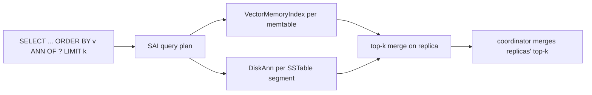

# AI Architecture

_Analysed 2026-10-08 against commit `33feca3d84`._

## Summary

Cassandra contains **no machine learning models, no LLM calls and no inference code**. What it has is infrastructure for AI applications: a vector data type and approximate nearest neighbour (ANN) search built into Storage Attached Indexes. That makes it usable as a vector store for retrieval-augmented generation alongside ordinary operational data.

## Components

| Piece | Location (under `src/java/org/apache/cassandra/`) | Notes |
|---|---|---|
| Vector CQL type `vector<float, N>` | `db/marshal/VectorType.java` | Gated by `vector_type_enabled`, default true (`config/Config.java:914`) |
| Similarity functions | `cql3/functions/VectorFcts.java` | `similarity_cosine`, `similarity_euclidean`, `similarity_dot_product` |
| ANN operator in query planning | `index/sai/plan/Expression.java:82`, `Operation.java:262-270`, `QueryController.java:199` | ANN is modelled as an index expression; a code comment (`VSTODO`, line 199) says it should become its own abstraction to allow general ORDER BY |
| In-memory graph | `index/sai/memory/VectorMemoryIndex.java`, `index/sai/disk/v1/vector/OnHeapGraph.java` | Built per memtable |
| On-disk graph | `index/sai/disk/v1/vector/DiskAnn.java`, `VectorPostings*.java`, `OnDiskOrdinalsMap.java` | Written at flush and compaction (`CompactionVectorValues.java`) |
| Segment search | `index/sai/disk/v1/segment/VectorIndexSegmentSearcher.java` | Brute-force fallback for small candidate sets |
| Library | JVector `1.0.2`, Lucene `9.12.0` (`.build/parent-pom-template.xml:1221-1232`) | JVector is the graph engine |

## Query flow

## Limits visible in this tree

- JVector 1.0.2 is several major versions behind current JVector, which has since added quantization and other features (the newer versions were not verified here; this is from general knowledge of the library's history).
- One ANN ordering per query (`Operation.java:262-266`); combining ANN with other predicates falls back to post-filtering.
- No hybrid lexical-plus-vector ranking, no built-in embedding generation, no reranking.
- Index memory is on-heap during build (`OnHeapGraph`, `RamEstimation`).

## If AI features are added later

Keep model inference out of the database process. The natural extension points are `cql3/functions/` (native functions), `index/Index.java` (index implementations) and `db/guardrails/` (limits on vector dimensions and result sizes).
