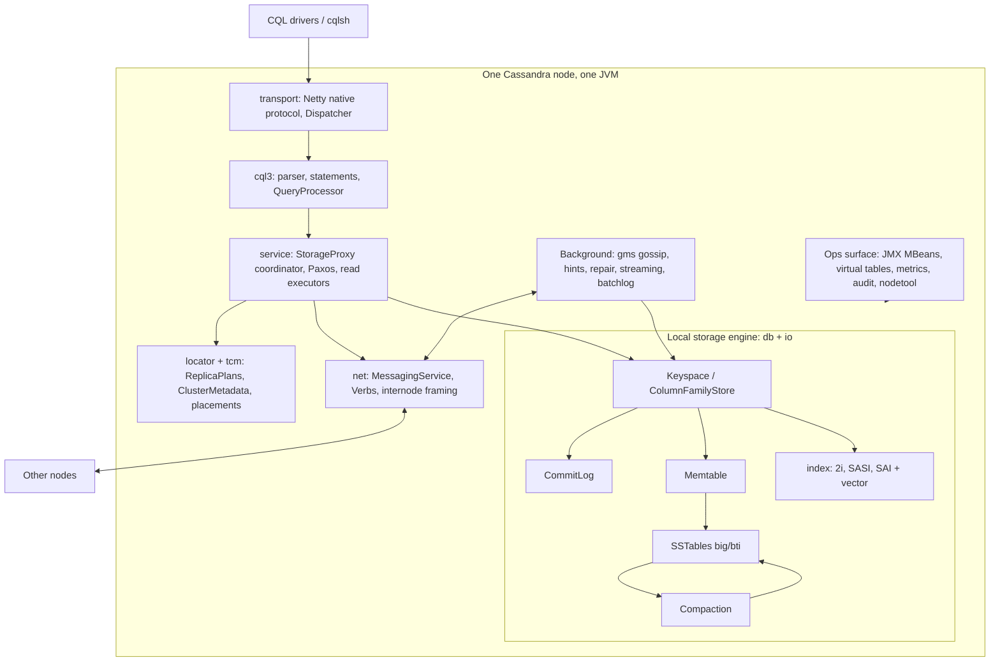
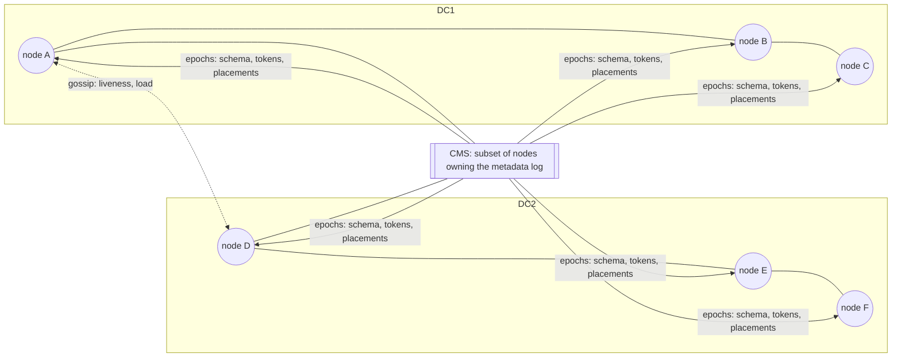
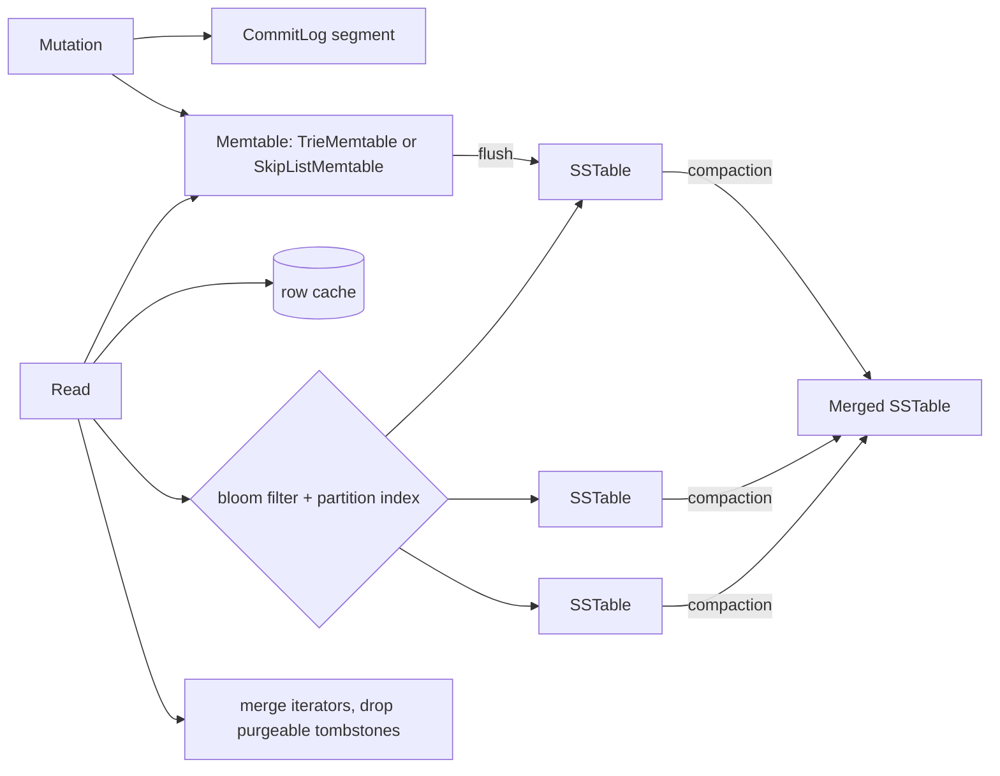

# Architecture

_Analysed 2026-10-08 against commit `33feca3d84`. Paths are relative to `src/java/org/apache/cassandra/`._

## Layered view

## Process model

A node is one JVM started by `service/CassandraDaemon.java` (`main` calls `activate`, line 721). Almost every subsystem is a process-wide singleton reached through a static `instance` field (130 such classes): `StorageService.instance`, `MessagingService.instance()`, `CommitLog.instance`, `CompactionManager.instance`, `Gossiper.instance`, `ClusterMetadataService.instance()`. Configuration is loaded once into static state in `config/DatabaseDescriptor.java` from `conf/cassandra.yaml` (`config/Config.java`, about 450 public fields) plus 335 system properties enumerated in `config/CassandraRelevantProperties.java`.

Work is done on named thread pools called stages (`concurrent/Stage.java`): `READ`, `MUTATION`, `COUNTER_MUTATION`, `VIEW_MUTATION`, `GOSSIP`, `ANTI_ENTROPY`, `MIGRATION`, `MISC` and others. Client requests run on a separate request executor in `transport/Dispatcher.java:58`.

## Cluster model

There are two control planes in this version:

1. **Transactional Cluster Metadata** (`tcm/`). Schema, node registration, token ownership and data placements live in one immutable `ClusterMetadata` object versioned by an `Epoch`. Changes are `Transformation`s (`tcm/transformations/`) committed to a log by the Cluster Metadata Service through `ClusterMetadataService.commit` (`tcm/ClusterMetadataService.java:508,534`). CMS members commit with Paxos (`PaxosBackedProcessor`), non-members forward (`RemoteProcessor`). Every node replays the log (`tcm/log/LocalLog.java`). Multi-step operations such as bootstrap, move and decommission are resumable sequences (`tcm/sequences/`).
2. **Gossip** (`gms/Gossiper.java`, 1 second rounds at line 149) still carries liveness for the failure detector (`gms/FailureDetector.java`) and application states such as load. It no longer decides ownership.

## Storage engine

- `db/Keyspace.java` and `db/ColumnFamilyStore.java` are the per-keyspace and per-table handles.
- `db/commitlog/` gives durability with periodic, group or batch sync, optional compression, encryption and direct I/O segments.
- `db/memtable/` holds a pluggable memtable API (`Memtable_API.md`).
- `io/sstable/format/big` is the classic format; `io/sstable/format/bti` is the trie-indexed format. `sstable.selected_format` chooses (`conf/cassandra.yaml:1173`).
- `db/compaction/` holds STCS, LCS, TWCS and UCS (`UnifiedCompactionStrategy.md`), driven by `CompactionManager`.
- `db/rows`, `db/partitions`, `db/transform` are the iterator model every read, compaction, repair and stream is built on.
- `utils/btree/BTree.java` (4,220 lines) is the in-memory row and column container.

## Extension points

| Interface | Location | Purpose |
|---|---|---|
| `Index` | `index/Index.java` | Secondary index implementations |
| `Memtable.Factory` | `db/memtable/Memtable.java` | Alternative memtables |
| `SSTableFormat` | `io/sstable/format/SSTableFormat.java` | On-disk formats |
| `AbstractCompactionStrategy` | `db/compaction/` | Compaction strategies |
| `IAuthenticator`, `IAuthorizer`, `IRoleManager`, `INetworkAuthorizer` | `auth/` | Security |
| `AbstractReplicationStrategy`, snitch / location providers | `locator/` | Placement |
| `ITrigger` | `triggers/` | Write hooks |
| `QueryHandler` | `cql3/QueryHandler.java` | Replace the query processor |
| `VirtualTable` | `db/virtual/` | Expose internals through CQL |
| `Guardrail` | `db/guardrails/` | Operator limits |

## Cross-cutting concerns

- **Observability**: Dropwizard metrics (`metrics/`), 38 MBean interfaces, virtual tables under `system_views` and `system_metrics`, tracing (`tracing/`), diagnostic events (`diag/`), audit and full query logs (`audit/`, `fql/`).
- **Backpressure**: client-side byte and rate limits (`transport/ClientResourceLimits.java`, `CQLMessageHandler.java:208`), internode limits (`net/ResourceLimits.java`), hints when replicas are down.
- **Testing architecture**: unit tests, in-JVM distributed tests (`test/distributed`), a deterministic simulator (`test/simulator`) and the Harry model-based fuzzer (`test/harry`).
