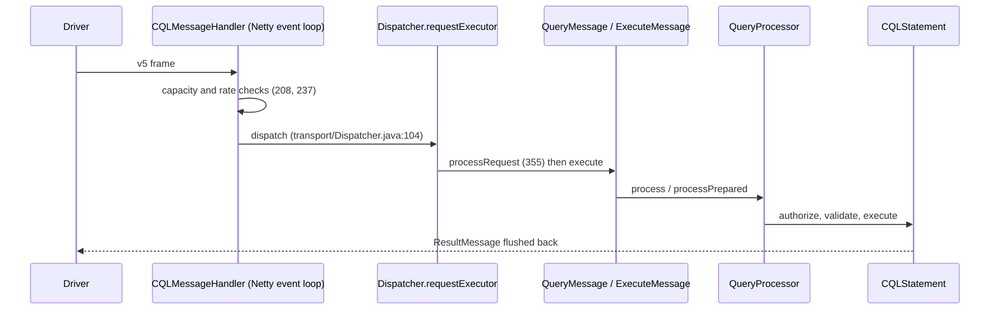
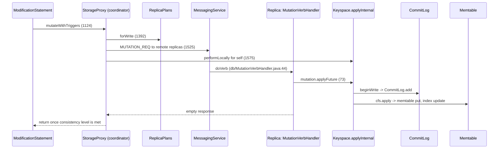

# Data Flows

_Traced 2026-10-08 in commit `33feca3d84`. Paths are relative to `src/java/org/apache/cassandra/`. Line numbers are for this commit and will drift._

## 1. Node startup

1. `service/CassandraDaemon.java:721` `activate` calls `applyConfig` (781), which loads `cassandra.yaml` through `DatabaseDescriptor`.
2. `setup` (225): `runStartupChecks` (264, checks in `service/StartupChecks.java`), then `Startup.initialize(seeds)` (269) brings up Transactional Cluster Metadata and decides whether this node is a first CMS node, joins an existing cluster, or is upgrading from gossip.
3. `CommitLog.instance.recoverSegmentsOnDisk()` (335) replays unflushed writes.
4. `StorageService.instance.initServer()` (370; defined at `service/StorageService.java:694`) starts gossip and messaging and joins the ring through a TCM sequence (`tcm/sequences/BootstrapAndJoin.java`).
5. Background tasks are scheduled: size estimates (358), background compaction submitter (405), speculation threshold updater (408).
6. `start` (641) calls `startNativeTransport` (828), opening the CQL port.

## 2. Client request intake (all statements)

- `transport/CQLMessageHandler.java:389` decodes an envelope and calls `dispatcher.dispatch` (395).
- `transport/Dispatcher.java:125` picks the auth or request executor. `processRequest` (355) rejects requests that already exceeded the native transport timeout (367).
- `transport/messages/QueryMessage.java:102` obtains the `QueryHandler` (115) and calls `cql3/QueryProcessor.java:360` `process`. Unprepared text is parsed by the ANTLR grammar (`src/antlr/Parser.g`, `Lexer.g`, `Cql.g`) via `parseStatement` (382). Prepared statements live in a Caffeine cache (`QueryProcessor.java:120-134`) and enter at `processPrepared` (837).
- `processStatement` (276) authorizes, validates and executes the statement.

## 3. Write path (INSERT / UPDATE / DELETE without IF)

- `cql3/statements/ModificationStatement.java:496` `execute` branches to `executeWithoutCondition` (510), which builds mutations and calls `StorageProxy.mutateWithTriggers` (534).
- `service/StorageProxy.java:1124` `mutateWithTriggers` runs triggers, then picks: `mutateAtomically` (1181) for logged batches (batchlog written first, `syncWriteToBatchlog` 1294), `mutateMV` (1010) for view-backed tables, or `mutate` (876).
- `performWrite` (1380) computes a `ReplicaPlan.ForWrite` from current cluster metadata (1392) and a response handler sized for the consistency level, then `sendToHintedReplicas` (1481): remote replicas get `MUTATION_REQ` (1525), down replicas get a hint (`submitHint` 1570, stored by `hints/HintsService`), the local replica is applied on the `MUTATION` stage (1575).
- Replica side: `db/MutationVerbHandler.java:44` handles forwarding for cross-DC writes (56-58) and applies (73).
- `db/Keyspace.java:444` `applyInternal`: takes view locks if needed (456), opens a write context at 546 (`db/CassandraKeyspaceWriteHandler.java:42`, which starts a `writeOrder` operation and appends to the commit log at 99 via `db/commitlog/CommitLog.java:300`), then for each partition update pushes view updates (563) and calls `cfs.getWriteHandler().write` (574) which lands in `ColumnFamilyStore.apply` (`db/ColumnFamilyStore.java:1462`): memtable put plus secondary index updates.
- Later: a memtable is switched and flushed to an SSTable (`ColumnFamilyStore.switchMemtable` 1028, `Flush` 1170), and `CompactionManager.submitBackground` (`db/compaction/CompactionManager.java:241`) merges SSTables.

## 4. Read path (single partition SELECT)

- `cql3/statements/SelectStatement.java:287` `execute` builds a `ReadQuery` (339) and calls `query.execute` (434), using a pager from `service/pager/` when paging.
- `db/SinglePartitionReadCommand.java:482` calls `StorageProxy.read` (`service/StorageProxy.java:1820`). SERIAL reads go to Paxos (1856); others go to `fetchRows`, which creates one `AbstractReadExecutor` per partition (2075), then `executeAsync` (2087), `maybeTryAdditionalReplicas` (2094, speculative retry) and `awaitResponses` (2102).
- `service/reads/AbstractReadExecutor.java:189` chooses never, percentile-based or always speculating executors. It sends one full data read and digest reads to the rest (120-132).
- Replica side: `db/ReadCommandVerbHandler.java:52` calls `command.executeLocally` (72), builds a response (74) and sends it (88).
- `db/ReadCommand.java:433` `executeLocally`: if an index plan exists it uses `searcher.search`, otherwise `queryStorage` (459); then purges tombstones (467), applies the row filter (472) and limits (498).
- `db/SinglePartitionReadCommand.java:495` `queryStorage` uses the row cache when enabled (500) or `queryMemtableAndDisk` (666). Named-row queries use the timestamp-ordered shortcut (698, 935) that stops once newer SSTables fully cover the request.
- Back on the coordinator, `DigestResolver` compares digests. On mismatch, `readRepair.startRepair` (`AbstractReadExecutor.java:439`) does a full data read and writes the reconciled result to stale replicas (`service/reads/repair/BlockingReadRepair.java`).
- Range scans use `service/reads/range/RangeCommands.java` via `StorageProxy.getRangeSlice` (2231).

## 5. Lightweight transaction (IF ...)

`ModificationStatement.executeWithCondition` (543) calls `StorageProxy.cas` (`service/StorageProxy.java:306`). If Paxos v2 is enabled it delegates to `service/paxos/Paxos.java` (324-325); otherwise `legacyCas` (329) runs prepare, read, propose, commit. The yaml default is still v1 (`config/Config.java:1043`).

## 6. Schema or topology change

A DDL statement (for example `cql3/statements/schema/CreateTableStatement`) becomes an `AlterSchema` transformation (`tcm/transformations/AlterSchema.java`) submitted through `ClusterMetadataService.commit` (`tcm/ClusterMetadataService.java:508`). `processor.commit` (545) is local Paxos on CMS nodes (`tcm/AbstractLocalProcessor.java:53`) or a remote call (`tcm/RemoteProcessor.java:75`). The new epoch is appended to the log, replicated to all nodes, and applied by `LocalLog`; listeners (`tcm/listeners/`) update local keyspaces and tables.

## 7. Vector / SAI query

`SELECT ... ORDER BY v ANN OF ? LIMIT k` produces an index query plan in `index/sai/plan/`. `Operation.java:262-270` detects the ANN expression and asks `QueryController.getTopKRows`. In-memory vectors are searched in `index/sai/memory/VectorMemoryIndex.java`; on-disk graphs through `index/sai/disk/v1/vector/DiskAnn.java` using the JVector library. The coordinator merges per-replica top-k results.

## 8. Repair

`nodetool repair` reaches `StorageService.repair` (`service/StorageService.java:2967`) and creates a `repair/RepairCoordinator`. Each `RepairSession` runs `RepairJob`s: replicas build Merkle trees (`repair/Validator.java`), the coordinator compares them, and differing ranges are streamed (`repair/StreamingRepairTask`, `streaming/StreamSession`). Incremental repair marks SSTables repaired through `repair/consistent/`.
